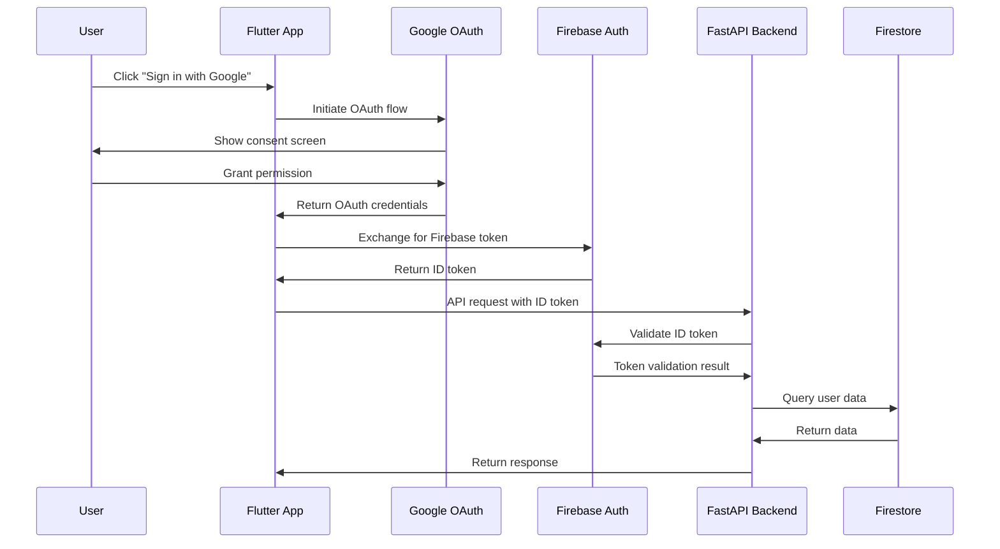
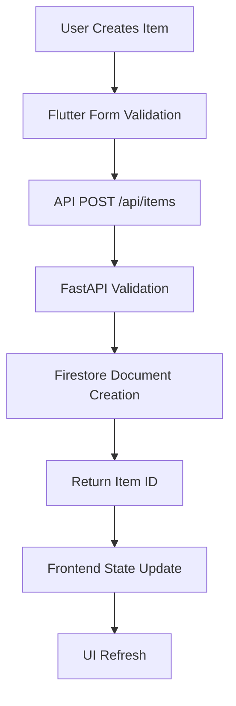
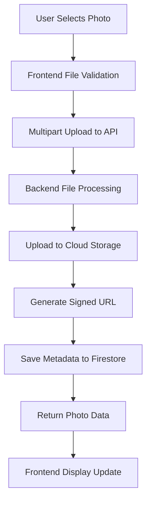

# System Architecture Overview

High-level architecture and design patterns for the Pottery Catalog Application.

## 🏗️ Architecture Diagram

```
┌─────────────────┐    ┌─────────────────┐    ┌─────────────────┐
│   Flutter Web   │    │   FastAPI       │    │   Google Cloud  │
│   Frontend      │────│   Backend       │────│   Platform      │
│                 │    │                 │    │                 │
│ • Authentication│    │ • REST API      │    │ • Firestore     │
│ • Photo Gallery │    │ • JWT Validation│    │ • Cloud Storage │
│ • Item CRUD     │    │ • Photo Upload  │    │ • Firebase Auth │
│ • Responsive UI │    │ • Business Logic│    │ • Cloud Run     │
└─────────────────┘    └─────────────────┘    └─────────────────┘
         │                        │                        │
         │                        │                        │
    ┌─────────────────────────────────────────────────────────────┐
    │                Firebase Authentication                      │
    │           OAuth 2.0 + Google Sign-In Integration           │
    └─────────────────────────────────────────────────────────────┘
```

## 🏛️ System Components

### Frontend Layer (Flutter Web)

**Technology**: Flutter 3.x with Dart
**Deployment**: Web-compiled to JavaScript
**Location**: `/frontend/`

**Key Components:**
- **Authentication Module**: Firebase Auth integration with Google Sign-In
- **Photo Gallery**: Responsive image display with grid layout
- **Item Management**: CRUD operations for pottery items
- **State Management**: Riverpod for application state
- **HTTP Client**: Dio for API communication

**Architecture Pattern**: Feature-based modular architecture
```
frontend/lib/src/
├── core/           # Shared utilities and configurations
├── data/           # Data layer (repositories, services, models)
├── domain/         # Business logic and entities
└── presentation/   # UI layer (pages, widgets, controllers)
```

### Backend Layer (FastAPI)

**Technology**: FastAPI with Python 3.11+
**Deployment**: Docker container on Google Cloud Run
**Location**: `/backend/`

**Key Components:**
- **API Router**: RESTful endpoints for items and photos
- **Authentication Middleware**: Firebase ID token validation
- **Business Services**: Firestore and Cloud Storage integrations
- **Data Models**: Pydantic models with validation
- **Error Handling**: Global exception handlers

**Architecture Pattern**: Service Layer Pattern
```
backend/
├── routers/        # API endpoint definitions
├── services/       # Business logic and external integrations
├── models/         # Data models and schemas
├── auth/           # Authentication and authorization
├── config/         # Configuration management
└── tests/          # Unit and integration tests
```

### Data Layer (Google Cloud)

**Primary Database**: Cloud Firestore (NoSQL)
**File Storage**: Google Cloud Storage
**Authentication**: Firebase Authentication

**Data Architecture:**
```
Firestore Collections:
├── pottery_items/
│   ├── {item_id}/          # Item document
│   │   ├── title           # String
│   │   ├── description     # String
│   │   ├── created_at      # Timestamp
│   │   ├── user_id         # String (owner)
│   │   └── photos/         # Subcollection
│   │       └── {photo_id}/ # Photo metadata
│   │           ├── filename
│   │           ├── gcs_path
│   │           └── upload_date
│   └── ...
└── users/                  # User profiles (future)

Cloud Storage Buckets:
├── {project}-bucket/
│   └── items/
│       └── {item_id}/
│           ├── {photo_id}.jpg
│           └── ...
```

## 🔐 Authentication Flow

### OAuth 2.0 + Firebase Integration



### JWT Token Flow

1. **Frontend**: Obtains Firebase ID token after Google OAuth
2. **Backend**: Validates Firebase ID token on each request
3. **Authorization**: Extracts user ID from validated token
4. **Data Isolation**: All queries filtered by authenticated user ID

## 📊 Data Flow Architecture

### Item Creation Flow



### Photo Upload Flow



## 🏗️ Design Patterns

### Backend Patterns

**Service Layer Pattern**
- **Purpose**: Separate business logic from API routing
- **Implementation**: `services/` directory with dedicated service classes
- **Benefits**: Reusable business logic, easier testing, clear separation

**Repository Pattern** (Implicit)
- **Purpose**: Abstract data access layer
- **Implementation**: Service classes act as repositories for Firestore/GCS
- **Benefits**: Swappable data sources, consistent data access

**Dependency Injection**
- **Purpose**: Manage service dependencies and configuration
- **Implementation**: FastAPI's dependency injection system
- **Benefits**: Testable code, configurable dependencies

### Frontend Patterns

**Feature-Based Architecture**
- **Purpose**: Organize code by business features rather than technical layers
- **Implementation**: `src/` organized by domain features
- **Benefits**: Scalable, maintainable, team-friendly

**State Management (Riverpod)**
- **Purpose**: Predictable state management across the application
- **Implementation**: Providers for different state concerns
- **Benefits**: Reactive UI, testable state, clear data flow

## 🚀 Deployment Architecture

### Development Environment
```
Local Machine:
├── Flutter Web (localhost:9100)
├── FastAPI + Docker (localhost:8000)
└── Firebase Project (pottery-app-456522)
```

### Production Environment
```
Google Cloud Platform:
├── Cloud Run (FastAPI container)
├── Firebase Hosting (Flutter web build)
├── Firestore (production database)
├── Cloud Storage (production files)
└── Firebase Auth (production auth)
```

## 📈 Scalability Considerations

### Performance Optimizations

**Backend:**
- **Cloud Run Autoscaling**: 1-100 instances based on demand
- **Connection Pooling**: Efficient database connections
- **Caching Strategy**: Firestore caching for repeated queries
- **Signed URLs**: Direct client-to-storage file access

**Frontend:**
- **Code Splitting**: Lazy loading of features
- **Image Optimization**: WebP format, responsive sizing
- **State Optimization**: Efficient state updates and re-renders
- **CDN Integration**: Firebase Hosting with global CDN

### Monitoring & Observability

**Application Monitoring:**
- **Cloud Monitoring**: GCP native monitoring
- **Error Tracking**: Sentry integration
- **Performance Monitoring**: Firebase Performance
- **Logging**: Structured logging with Cloud Logging

**Key Metrics:**
- API response times
- Authentication success rates
- Photo upload success rates
- User session duration
- Error rates by endpoint

## 🔧 Development Workflow

### Local Development
1. **Backend**: Docker container with `.env.local`
2. **Frontend**: Flutter web with hot reload
3. **Database**: Shared development Firestore
4. **Authentication**: Local OAuth configuration

### CI/CD Pipeline
1. **Code Push**: Trigger GitHub Actions
2. **Testing**: Automated test suite
3. **Building**: Docker image for backend, web build for frontend
4. **Deployment**: Cloud Run + Firebase Hosting
5. **Verification**: Smoke tests on deployed environment

## 📋 Architecture Decisions

### Technology Choices

| Component | Technology | Rationale |
|-----------|------------|-----------|
| **Backend** | FastAPI | High performance, automatic OpenAPI docs, modern Python |
| **Frontend** | Flutter Web | Single codebase for web/mobile, excellent developer experience |
| **Database** | Firestore | NoSQL flexibility, real-time capabilities, Firebase integration |
| **Storage** | Cloud Storage | Scalable file storage, integrated with GCP ecosystem |
| **Auth** | Firebase Auth | OAuth integration, secure token management, easy setup |
| **Deployment** | Cloud Run | Serverless scaling, containerized deployment, cost-effective |

### Design Trade-offs

**Firestore vs PostgreSQL**
- ✅ **Chosen**: Firestore for NoSQL flexibility and Firebase integration
- ❌ **Alternative**: PostgreSQL for relational data and complex queries
- **Rationale**: Simple data model, real-time features, integrated auth

**Monolith vs Microservices**
- ✅ **Chosen**: Monolithic FastAPI application
- ❌ **Alternative**: Microservices architecture
- **Rationale**: Simpler deployment, faster development, appropriate scale

---

*Next: [API Reference](./api-reference.md)*
